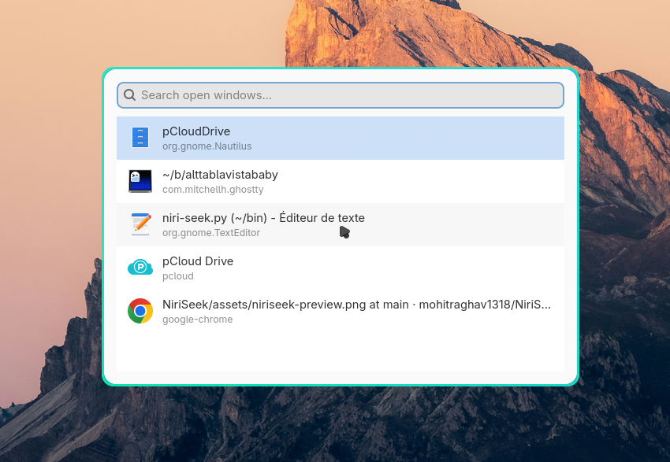

# alttablavistababy

This is a https://github.com/mohitraghav1318/NiriSeek port in python for no good reason.

"Alt Tab La Vista, Baby!" is a simple window search tool for Niri : it will display a list of windows so you can switch to it. Press Esc to escape - wow!

Yes, like you could do with https://github.com/abenz1267/walker for example.

Install : well generally you just put the python code somewhere and bind it

    Mod+Return { spawn-sh "/path/to/niri-seek.py" ;}

But i use NixOS by the way, so nothing works. So I asked AI to write a ridiculous wrapper. Just ignore it if you use some real OS. If ever you are on the same boat, then rather bind key to "niri-seek" command. You will need to invoke the wrapper to *install* python code. 

    nix-env -f /path/to/niriseek-wrapper.nix -iA niri-seek
    
So any python change will need to reinstall. ( This wrapper because otherwise it works in terminal but not when invoked from a keybind... hence the wrapper...)

